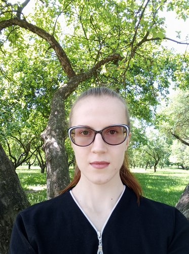

# Ulyana Brataus

## Contacts:
* Email: ubrataus@gmail.com
* Phone: +375 29 618 35 37
* Github: [UlyanaBrataus](https://github.com/UlyanaBrataus)
* Location: Minsk, Belarus
## About myself:
Best self description in the world.
## Skills
* HTML
* CSS
* JavaScript
* Git
* Figma
## Code example:
```
function songDecoder(song){
 return song.split('WUB').join(' ').replace(/\s+/g, ' ').trim() 
}
```
## Education:
* Build Responsive Real-World Websites with HTML and CSS (Udemy)
* JavaScript 2.0 (by Luschenko Alexander)
* MSLU (studying part-time)

## English:
English level - **B2**
